<!-- README.md is generated from README.Rmd. Please edit that file -->

# sfislands

<!-- badges: start -->
<!-- badges: end -->

The goal of `sfislands` is to make it easier to deal with geographic
datasets which contain islands.

- These do not have to be “literal” islands but any situation where
  discontiguous geographical units are present.

Such a situation can lead to two issues.

- Firstly, if unaddressed, the presence of such islands or exclaves can
  make certain types of contiguity-based modelling impossible.

- Secondly, just because two areas are separated by, say, a body of
  water, this does not mean that they are necessarily independent.

This package offers solutions to allow for the inclusion or exclusion of
these units within an uncomplicated workflow.

## Installation

You can install the development version of `kh` from
[GitHub](https://github.com/) with:

``` r
# install.packages("devtools")
devtools::install_github("horankev/sfislands")
```

## Summary of features

1.  The initial setting up neighbourhood structures can be frustrating
    for people who are eager to get started with fitting spatial models.
    This is especially so when the presence of discontiguities within a
    geographical dataset means that, even having set up a neighbours
    list, the model will still not run without further awkward data
    manipulations.

2.  As an aid to setting up contiguity structures, particularly when
    islands are involved, the package has a function to quickly map any
    contiguity structure for visual inspection. This can also be used to
    examine the output of `sfdep` contiguity functions. Such maps can be
    used to check if the structure makes sense, given the researcher’s
    knowledge about the geography of the study area.

3.  If there are some contiguities present which are not appropriate, or
    if you wish to add additional ones, there are functions to allow
    this to be done in a straightforward and openly reportable way.

4.  Once an appropriate neighbourhood structure is in place, different
    types of statistical tests and models can be performed. `sfdep`
    contains functionality to perform such test, and the output from
    `sfislands` can be used in its functions.

5.  The contiguity outputs from `sfislands` can be directly used to fit
    different types of (multilevel) (I)CAR models using, for example,
    the `mgcv`, `brms`, `stan` or `INLA` packages.

6.  For `mgcv` in particular, the predictions of such models can be
    quite tedious to extract and visualise. `sfislands` can streamline
    this workflow from the human side. Furthermore, there is a function
    to draw maps of these predictions for quick inspection.

## Functions overview

The following is a framework within which the `sfislands` functions
could be used:

### Step 1: Set up data (“*pre-functions*”)

- **st_bridges()**

*Create a contiguity list, matrix, or `sf` dataframe with a contiguity
list or matrix as column “nb”, while accounting for islands.*

- **st_quickmap_contigs()**

*Check contiguities visually on map.*

- **st_check_islands()**

*Check assignment of island contiguities in a dataframe.*

- **st_manual_join_nb()**

- **st_manual_cut_nb()**

*Make manual changes to any connections.*

### Step 2: Create model

*Use the output of **st_bridges()** as both the data and contiguity
inputs for a model using, for example, `mgcv`, `brms` or `inla`.*

### Step 3: Examine output (“*post functions*”)

- **st_augment()**

*Augment the original dataframe with model predictions.*

- **st_quickmap_preds()**

*Generate quick maps of these predictions.*

Below, we look at these functions in more detail and show them in
operation.

## Pre-functions

`sfdep` offers excellent tools for building contiguity structures, among
other things. It has a range of functions depending on how we want to
define contiguity.

However, often when preparing areal spatial data, the presence of
uncontiguous areas (such as islands or exclaves) can create
difficulties. We might also want to account for some hidden contiguities
by allowing bridges, tunnels etc. to render two uncontiguous areas as
neighbours.

`sfislands` provides functions to make this task easier.

It also provides a number of further helper functions to examine these
contiguity structures and use them in models such that the workflow is
streamlined from the human side.

### Mainland France (`guerry` dataset)

`sfislands` is intended to be used alongside the `sfdep` package. The
principal functions from `sfdep` for areal data are demonstrated in its
vignette using the `guerry` dataset. This data applies to the
geographical area of mainland France as shown below:

``` r
g <- guerry |> 
  st_as_sf()

ggplot(g) + 
  geom_sf() + 
  theme_void()
```

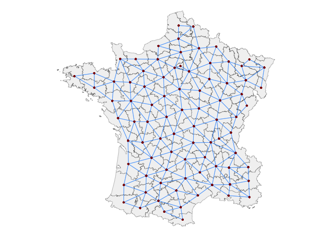

In this French example, the `st_islands` function **st_bridges()**
produces exactly the same contiguity structure as
**sfdep::st_contiguity()**. This can be seen below by piping these
neighbourhood outputs through the `st_islands` function
**st_quickmap_contigs()** which draws an easily editable map of the
applied contiguity structure. This function works with contiguities
constructed from any package as long as they are in list or matrix form.

For **st_quickmap_contigs()**, the contiguities should be within an `sf`
dataframe as a column called “nb”. **st_bridges()** does this
automatically whereas the “nb” column needs to be added when using
`sfdep` functions.

#### sfislands::st_bridges()

The `st_bridges()` contiguities below, where each department is
considered a neighbour of another if it touches it at least one point…

``` r
g |> st_bridges("department") |> 
  st_quickmap_contigs()
```

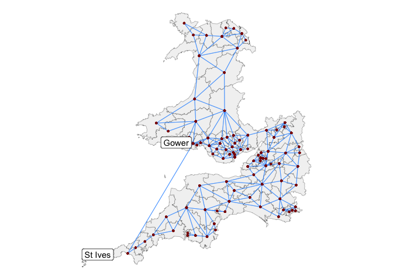

… are the same as these from `sfdep`:

#### sfdep::st_contiguity()

``` r
g |> mutate(nb = st_contiguity(geometry)) |> 
  st_quickmap_contigs()
```

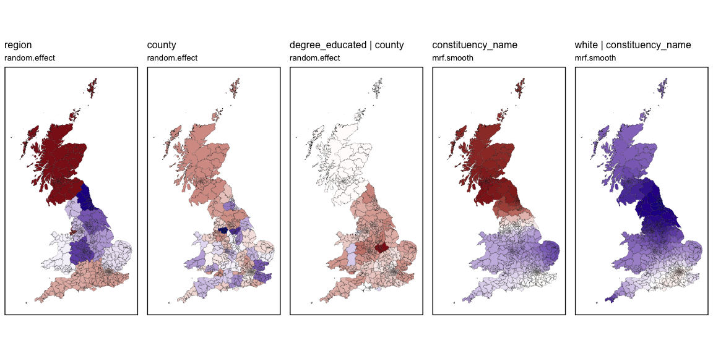

As these maps are produced using `ggplot2`, their characteristics can be
edited using normal `ggplot2` syntax (see 1, below). For convenience,
simple arguments are also provided (see 2, below) for changing the core
characteristics of the map in a simple way:

``` r
ggarrange(
  
  g |> mutate(nb = st_contiguity(geometry)) |> 
    st_quickmap_contigs() +
    geom_sf(data = g |> group_by(region) |> summarise(), 
            linewidth = 0.5, colour = "black", fill = NA) + 
    labs(title = "st_quickmap_contigs()",
         subtitle = "1. using ggplot syntax") + 
    theme_minimal() +
    theme(panel.background = element_rect(fill = "aquamarine3", color = "black"),
          axis.text = element_blank()),
  
  g |> mutate(nb = st_contiguity(geometry)) |> 
    st_quickmap_contigs(linkcol = "orange", 
                        bordercol = "white", 
                        pointcol = "yellow", 
                        fillcol = "black", 
                        linksize = 0.4, 
                        bordersize = 0.3, 
                        pointsize = 0.8,
                        title = "st_quickmap_contigs()",
                        subtitle = "2. using simplified arguments"),
  
  ncol=2
)
```

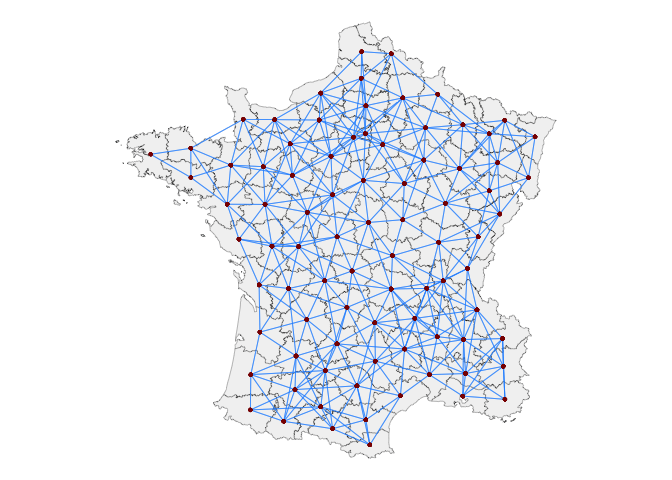

`sfdep` offers a number of different types of contiguity structure, a
selection of which are shown below. These can again be conveniently
visualised using the **st_quickmap_contigs()** function:

#### sfdep::st_dist_band()

All areas within a certain distance are considered neighbours:

``` r

g |> mutate(nb = st_geometry(g) |> 
              st_dist_band(upper = 150000)) |> 
  st_quickmap_contigs()
```

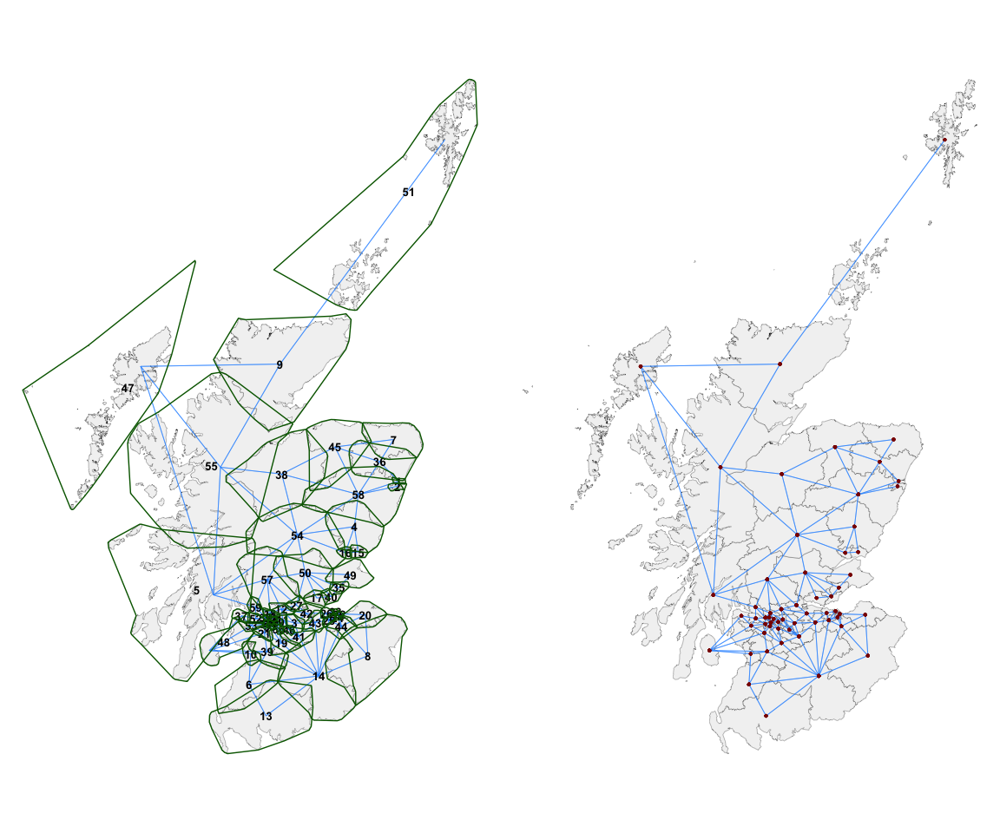

#### sfdep::st_knn()

The k-nearest-neighbours (here, 1) to each area are considered
neighbours:

``` r

g |> mutate(nb = st_geometry(g) |> 
              st_knn(1, symmetric = TRUE)) |> 
  st_quickmap_contigs()
```


#### sfdep::st_block_nb()

All areas within a chosen block are considered neighbours:

``` r

id <- g$code_dept
regime <- g$region
g |> 
  mutate(
    nb = st_block_nb(regime, id)
  ) |> 
  st_quickmap_contigs()
```

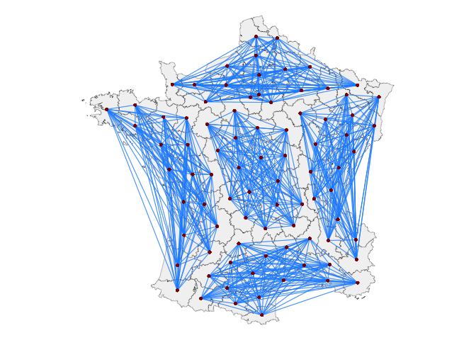

#### sfdep::st_lag_cumul()

Cumulative higher orders of contiguity such as also including
neighbours-of-neighbours:

``` r

g |> mutate(nb = st_contiguity(geometry) |> st_nb_lag_cumul(2)) |> 
  st_quickmap_contigs()
```

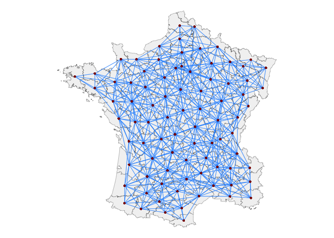

However, the `sfdep` functions above which rely on contiguity will run
into difficulties if we consider the following geography:

### England, Scotland & Wales

In the context of the constituencies of England, Scotland and Wales,
there will be problems due to the presence of islands which will not
feature in these graphs unless we attempt to pick out these islands and
set up a buffer around them. This process is, however, cumbersome and
can induce contiguities which are not intended.

One potential remedy is to entirely exclude islands from the study,
another is to construct a contiguity structure according to your desired
criteria and then set the islands to be contiguous to their closest *k*
constituencies.

`st_bridges()` can do both of these things.

Below is the map in question:

There are island constituencies in the north around Scotland but also
less obvious ones in Wales and England. The constituencies which are
non-contiguous are outlined in red below:


To incorporate these we use `st_bridges()`. We can set `remove_islands`
to TRUE if we decide to simply exclude the islands, or we set
`link_k_islands` to the closest k constituencies to each islands which
we want to bridge.

Below, with the argument `remove_islands` set to TRUE, we simply remove
these islands from the dataset entirely.

``` r
nbsf <- st_bridges(df = df_scaled_sf,
                  geom_col_name = "constituency_name",
                  remove_islands = T)
st_quickmap_contigs(nbsf,
                     pointsize=0.05,
                    title = "st_bridges() contiguities",
                    subtitle = "no island constituencies\n(islands which remain are part of a contiguous constituency)")
```

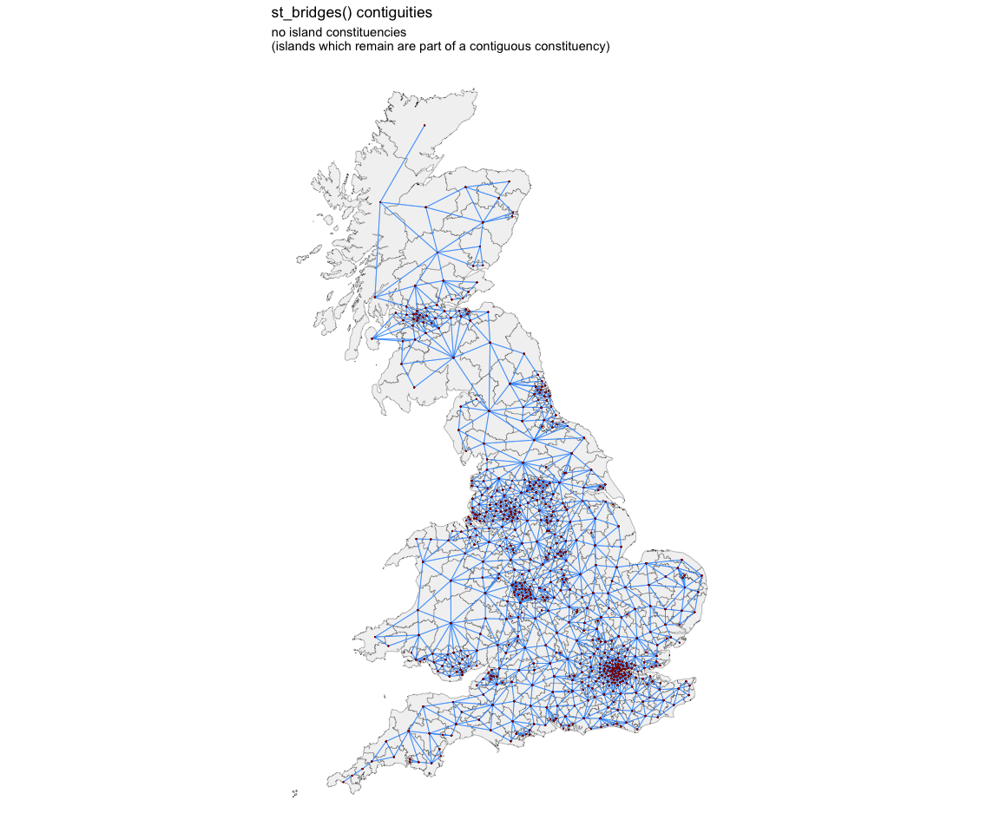

Alternatively, we can join islands to the nearest, say, 2
constituencies. `st_bridges()` by default returns the original dataframe
augmented with a “nb” column which contains the contiguities in list
form.

``` r
nbsf <- st_bridges(df = df_scaled_sf,
                  geom_col_name = "constituency_name",
                  link_islands_k = 2)
st_quickmap_contigs(nbsf,
                     pointsize=0.05, 
                    title = "st_bridges() contiguities",
                      subtitle = "islands linked to k=2 nearest constituencies")
```

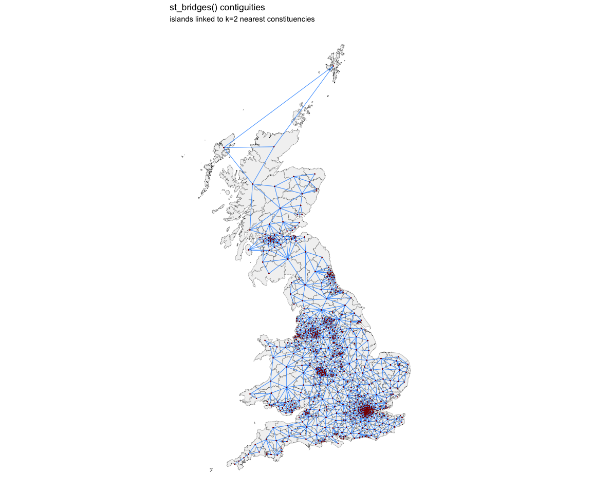

The contiguity structure which is created can be either a named list
(the default) or a named matrix. Different modelling packages have
different requirements for this. Furthermore, we can choose
`add_to_dataframe` to be TRUE (the default) to return a dataframe with a
column called `nb` which contains the named list or matrix. If FALSE,
only the contiguity structure itself is returned

These options can be seen in the unexecuted code below:

``` r
nbsf <- st_bridges(df = sf_dataframe,
                  geom_col_name = "the column containing the names of the contiguous areas",
                  remove_islands = T/F,
                  link_islands_k = 1...n,
                  nb_structure = "list"/"matrix",
                  add_to_dataframe = T/F,
                  title = "title",
                  subtitle = "subtitle")
```

The contiguity is here in a list form:

``` r

head(nbsf$nb)
#> $Aberavon
#> [1]  80 157 371 419 451 547
#> 
#> $Aberconwy
#> [1]  12 141 181 630
#> 
#> $`Aberdeen North`
#> [1]   4 239 595
#> 
#> $`Aberdeen South`
#> [1]   3 595
#> 
#> $`Airdrie and Shotts`
#> [1] 142 156 309 327 332 369
#> 
#> $Aldershot
#> [1]  70 395 517 544
```

But the “nb” column can also be a matrix, and `st_quickmap_contigs()`
will still return the same map:

``` r
nbsf <- st_bridges(df = df_scaled_sf,
                  geom_col_name = "constituency_name",
                  remove_islands = F,
                  link_islands_k = 2,
                  nb_structure = "matrix",
                  add_to_dataframe = T)
st_quickmap_contigs(nbsf,
                     pointsize=0.05)
```

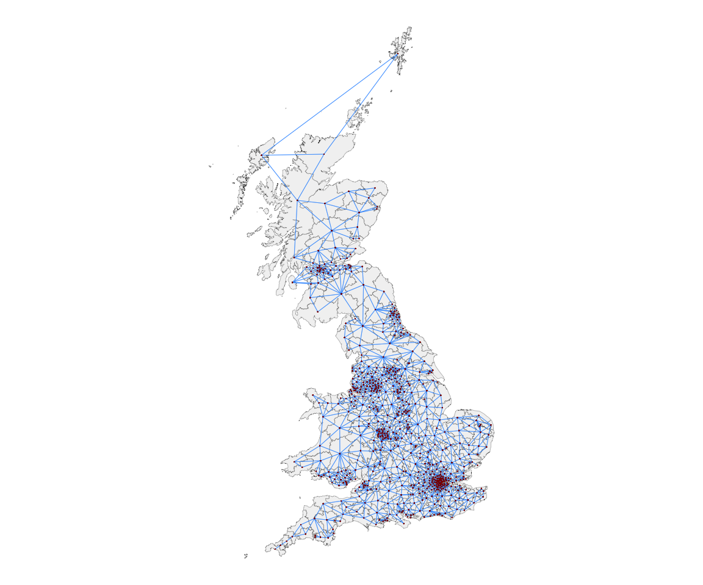

The matrix contiguity structure is now of the following form:

``` r

nbsf$nb[1:10,1:10]
#>                          [,1] [,2] [,3] [,4] [,5] [,6] [,7] [,8] [,9] [,10]
#> Aberavon                    0    0    0    0    0    0    0    0    0     0
#> Aberconwy                   0    0    0    0    0    0    0    0    0     0
#> Aberdeen North              0    0    0    1    0    0    0    0    0     0
#> Aberdeen South              0    0    1    0    0    0    0    0    0     0
#> Airdrie and Shotts          0    0    0    0    0    0    0    0    0     0
#> Aldershot                   0    0    0    0    0    0    0    0    0     0
#> Aldridge-Brownhills         0    0    0    0    0    0    0    0    0     0
#> Altrincham and Sale West    0    0    0    0    0    0    0    0    0     0
#> Alyn and Deeside            0    0    0    0    0    0    0    0    0     0
#> Amber Valley                0    0    0    0    0    0    0    0    0     0
```

### Editing the contiguities

There are also functions for manually changing the results of a
contiguity construction. It may be the case that you want to add some
additional contiguities or to remove others. For example, you may be
aware from local knowledge of connectivities which are not represented
by mere contiguity of polygons. The presence of tunnels or bridges
across a body of water would be an example of such a situation. The
functions `st_manual_join_nb()` and `st_manual_cut_nb()` do this.

#### sfisland::st_check_islands()

To make the use of these functions easier and more intuitive, the
function `st_check_islands()` shows us what contiguities have been set
up for the islands by `st_bridges()`:

``` r
nbsf |> st_check_islands()
#>            island_names island_num nb_num                              nb_names
#> 1        Isle Of Wight         292    378                       New Forest East
#> 2        Isle Of Wight         292    379                       New Forest West
#> 3 Na h-Eileanan An Iar         370    101 Caithness, Sutherland and Easter Ross
#> 4 Na h-Eileanan An Iar         370    423                   Orkney and Shetland
#> 5 Na h-Eileanan An Iar         370    461               Ross, Skye and Lochaber
#> 6  Orkney and Shetland         423    101 Caithness, Sutherland and Easter Ross
#> 7  Orkney and Shetland         423    370                  Na h-Eileanan An Iar
#> 8             Ynys Mon         630      2                             Aberconwy
#> 9             Ynys Mon         630     12                                 Arfon
```

Sometimes, as in this case, certain islands will have more than the
specified k neighbours. This is due to the need for symmetry in the
structure.

#### st_manual_join_nb() / st_manual_cut_nb()

Let us say we want to change some of these. For example, I will cut the
tie between **Isle Of Wight** and **New Forest East** (using their
numbers) and also between **Ynys Mon** and **Arfon** (using their
names):

``` r
nbsf |> 
  st_manual_cut_nb(292,378) |>
  st_manual_cut_nb("Ynys Mon","Arfon") |>
  st_check_islands()
#>            island_names island_num nb_num                              nb_names
#> 1        Isle Of Wight         292    379                       New Forest West
#> 2 Na h-Eileanan An Iar         370    101 Caithness, Sutherland and Easter Ross
#> 3 Na h-Eileanan An Iar         370    423                   Orkney and Shetland
#> 4 Na h-Eileanan An Iar         370    461               Ross, Skye and Lochaber
#> 5  Orkney and Shetland         423    101 Caithness, Sutherland and Easter Ross
#> 6  Orkney and Shetland         423    370                  Na h-Eileanan An Iar
#> 7             Ynys Mon         630      2                             Aberconwy
```

As extra contiguities can be difficult to distinguish, an extreme case
is shown below to demonstrate `st_manual_join_nb()`. **Gower** in South
Wales is joined to **St Ives** in Cornwall and then mapped:

``` r
st_bridges(df = df_scaled_sf|> filter(region %in% c("Wales","South West")),
           geom_col_name = "constituency_name",
           link_islands_k = 2
)  |> 
  st_manual_join_nb("Gower","St Ives")
#> Simple feature collection with 95 features and 10 fields
#> Geometry type: GEOMETRY
#> Dimension:     XY
#> Bounding box:  xmin: 86995.12 ymin: 7057.949 xmax: 435914.6 ymax: 395314.9
#> Projected CRS: OSGB36 / British National Grid
#> First 10 features:
#>    degree_educated health_not_good     white  con_swing population     region
#> 1      -1.21794372      2.46944799 0.6393329  8.5917223      66133      Wales
#> 2       0.04609836      0.56669033 0.6561204  2.2040312      56415      Wales
#> 3      -0.65926781     -0.19820480 0.6815335  5.6002269      82505      Wales
#> 4       0.13773571     -0.47810327 0.4232541  1.8868449      60573      Wales
#> 5       1.34650480     -1.04380699 0.2421197 -1.4808353      88859 South West
#> 6      -1.39315875      2.55186039 0.6988631  6.5435265      69814      Wales
#> 7       0.16003516      0.01078566 0.2461538  0.7731324     102152 South West
#> 8      -0.39901431      0.30711727 0.3126551  2.3754455      98968 South West
#> 9       0.13143648      0.92867578 0.6636099  6.3803885      69197      Wales
#> 10     -0.01572332      0.99556912 0.6123950  6.8025826      79873      Wales
#>                     county      constituency_name
#> 1           West Glamorgan               Aberavon
#> 2                    Clwyd              Aberconwy
#> 3                    Clwyd       Alyn and Deeside
#> 4                  Gwynedd                  Arfon
#> 5                     Avon                   Bath
#> 6  Gwent and Mid Glamorgan          Blaenau Gwent
#> 7                   Dorset       Bournemouth East
#> 8                   Dorset       Bournemouth West
#> 9                    Powys Brecon and Radnorshire
#> 10 Gwent and Mid Glamorgan               Bridgend
#>                          geometry country                            nb
#> 1  POLYGON ((290786.3 202886.7...   Wales        10, 31, 48, 59, 65, 76
#> 2  POLYGON ((283209.3 381440.5...   Wales                 4, 30, 34, 95
#> 3  POLYGON ((331643.4 372873.5...   Wales                29, 30, 32, 93
#> 4  POLYGON ((265248 356616.9, ...   Wales                     2, 34, 95
#> 5  POLYGON ((374536.5 167755.8... England                            55
#> 6  POLYGON ((320317.6 213680.5...   Wales             9, 41, 44, 46, 84
#> 7  POLYGON ((416915.9 91439.65... England                         8, 28
#> 8  POLYGON ((409021.9 95974.77... England                 7, 28, 45, 63
#> 9  POLYGON ((316452.2 284629.3...   Wales 6, 22, 25, 31, 44, 46, 47, 48
#> 10 POLYGON ((295421.8 179870.3...   Wales                     1, 59, 89
```

These manual functions can also, of course, be used to edit any of the
previously discussed contiguity structures created by `sfdep`.

For example, looking just at Scotland we can use
`sfdep::st_nb_lag_cumul()` to get first and second degree neighbours:

``` r

df_scaled_sf |> 
  filter(region == "Scotland") |> 
  mutate(nb = st_contiguity(df_scaled_sf$geometry[df_scaled_sf$region == "Scotland"]) |> 
           st_nb_lag_cumul(2)) |>  
  st_quickmap_contigs()
```

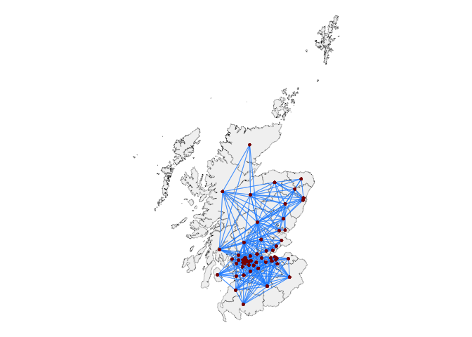

This does not include the island constituencies. We can chose to include
them by first using `st_bridges()` with k=2…

``` r

df_scaled_sf |> 
  filter(region == "Scotland") |> 
  st_bridges(geom_col_name = "constituency_name",
             link_islands_k = 2) |> 
  st_quickmap_contigs()
```

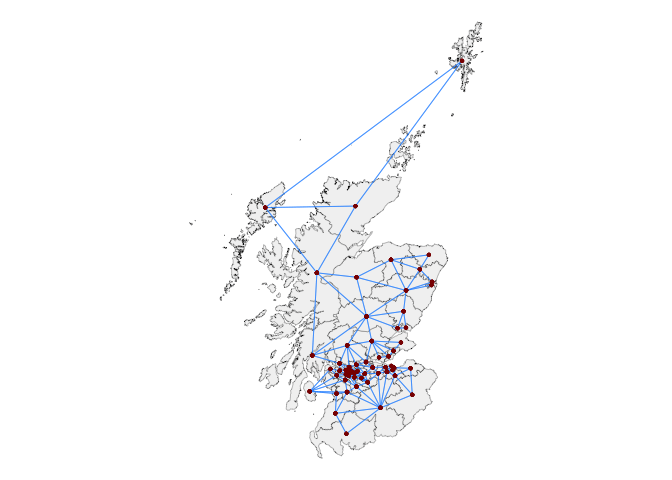

… and then examining the connections which have been made for islands:

``` r

df_scaled_sf |> 
  filter(region == "Scotland") |> 
  st_bridges(geom_col_name = "constituency_name",
             link_islands_k = 2) |> 
  st_check_islands()
#>            island_names island_num nb_num                              nb_names
#> 1 Na h-Eileanan An Iar          47      9 Caithness, Sutherland and Easter Ross
#> 2 Na h-Eileanan An Iar          47     51                   Orkney and Shetland
#> 3 Na h-Eileanan An Iar          47     55               Ross, Skye and Lochaber
#> 4  Orkney and Shetland          51      9 Caithness, Sutherland and Easter Ross
#> 5  Orkney and Shetland          51     47                  Na h-Eileanan An Iar
```

We can then add these island connections to the output of
`sfdep::st_nb_lag_cumul()`:

``` r

df_scaled_sf |> 
  filter(region == "Scotland") |> 
  mutate(nb = st_contiguity(df_scaled_sf$geometry[df_scaled_sf$region == "Scotland"]) |> 
           st_nb_lag_cumul(2)) |> 
  st_manual_join_nb(47,9) |>
  st_manual_join_nb(47,51) |>
  st_manual_join_nb(47,55) |>
  st_manual_join_nb(51,9) |>
  st_manual_join_nb(51,47) |>
  st_quickmap_contigs()
```

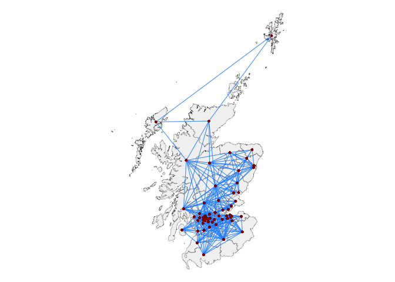

## Modelling & post-functions

Having set up a contiguity structure and embedded it as a named list or
matrix within the original `sf` dataset as column `nb`, there are some
functions to make it easy to quickly perform ICAR smoothing, augment the
original dataframe with these predictions, and visualise them.

For example, we can use the `mgcv` package to generate a Markov Random
Field ICAR smooth of poor health across the study area. This is done
very quickly by using `st_bridges()` to prepare the data, putting that
inside the `mgcv` GAM formulation, and then piping into the
`st_augment()` and `st_quickmap_preds()` functions.

``` r

prep_data <- st_bridges(df_scaled_sf, "constituency_name")

gam(health_not_good ~ s(constituency_name, bs='mrf', xt=list(nb=prep_data$nb), k=100),
        data=prep_data, method="REML") |>
  st_augment(prep_data) |>
  st_quickmap_preds()
#> [[1]]
```

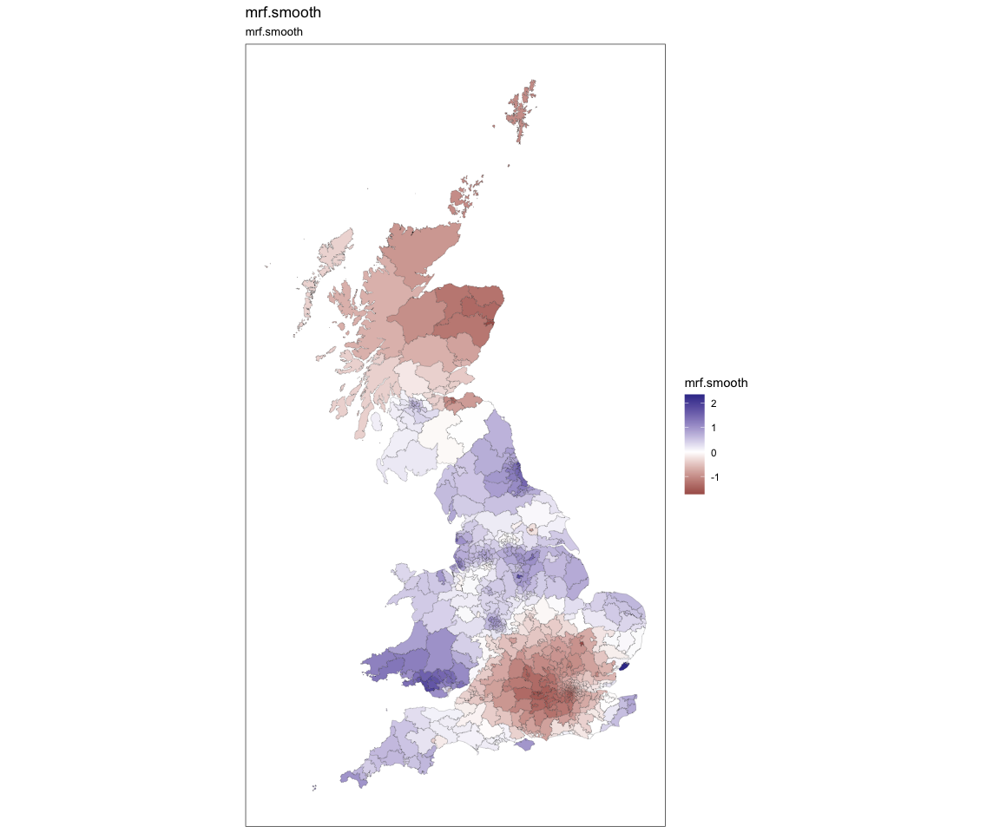

An equivalent model, this time smoothing over degree_educated, can be
fitted using `brms`. This package requires the contiguity to be in
matrix form:

``` r

prep_data2 <- st_bridges(df_scaled_sf, "constituency_name", nb_structure = "matrix")

# fit <- brm(degree_educated ~ car(W, gr=constituency_name, type="icar"),
#            data = prep_data2, data2 = list(W=prep_data2$nb),
#            family = gaussian(),file = "brmsfit_degree")

fit <- readRDS("brmsfit_degree.rds")

prep_data2$brmsfit <- predict(fit,prep_data2)[,1]

ggplot(prep_data2)+geom_sf(aes(fill=brmsfit), linewidth=0.1) +
  scale_fill_gradient2(low="firebrick4",mid="white",high="darkblue",midpoint = 0) +
  coord_sf(datum=NA) +
  theme_minimal() +
  theme_bw()
```

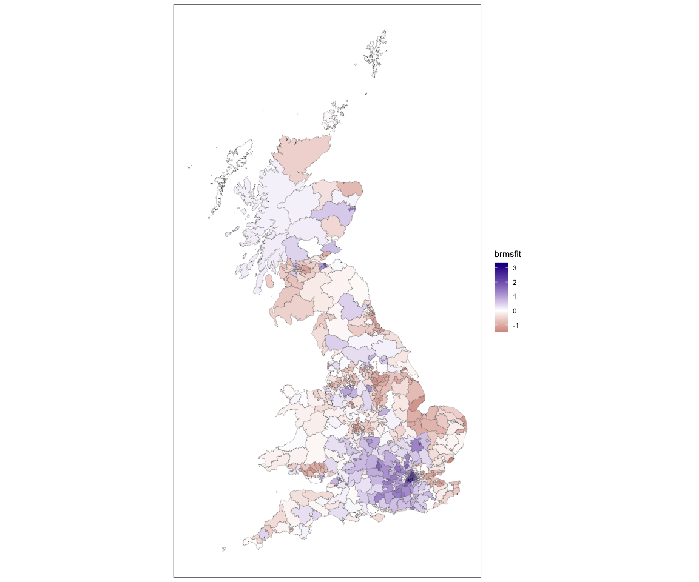

More complex models with random effects and multiple smooths are also
possible with `mgcv` and the `st_augment()` and `st_quickmap_preds()`
functions can handle these and label the columns and maps which are
generated appropriately. This is shown below with a model of swing in
the 2019 election:

``` r

prep_data3 <- st_bridges(df_scaled_sf, "constituency_name") # decide upon the contiguities and add them to the df

model <- gam(con_swing ~ 
               s(region, bs="re") + # region level random intercept
               s(county, bs="re") + # county level random intercept
               s(county, degree_educated, bs="re") + # county level random coefficient
               s(constituency_name, bs='mrf', 
                 xt=list(nb=prep_data3$nb),k=10) + # ICAR constituency ICAR varying coefficients
               s(constituency_name, by=white, bs='mrf', 
                 xt=list(nb=prep_data3$nb),k=10), # ICAR constituency ICAR varying coefficients
             data=prep_data3, method="REML") |> 
  st_augment(prep_data3) |> # pipe into function to get estimates
  st_quickmap_preds() # pipe into this for visualisation

ggarrange(plotlist = model, legend = "none", nrow=1)
```

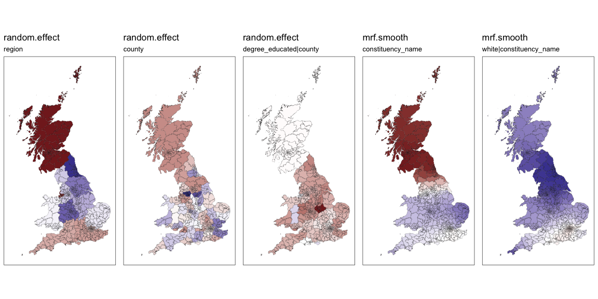

To see the estimates returned:

``` r

gam(con_swing ~ 
               s(region, bs="re") + # region level random intercept
               s(county, bs="re") + # county level random intercept
               s(county, degree_educated, bs="re") + # county level random coefficient
               s(constituency_name, bs='mrf', 
                 xt=list(nb=prep_data3$nb),k=10) + # ICAR constituency ICAR varying coefficients
               s(constituency_name, by=white, bs='mrf', 
                 xt=list(nb=prep_data3$nb),k=10), # ICAR constituency ICAR varying coefficients
             data=prep_data3, method="REML") |> 
  st_augment(prep_data3) |> 
  head()
#> Simple feature collection with 6 features and 20 fields
#> Geometry type: GEOMETRY
#> Dimension:     XY
#> Bounding box:  xmin: 264110.4 ymin: 148666.1 xmax: 488768.5 ymax: 812377.5
#> Projected CRS: OSGB36 / British National Grid
#>   degree_educated health_not_good      white  con_swing population     region
#> 1     -1.21794372       2.4694480  0.6393329  8.5917223      66133      Wales
#> 2      0.04609836       0.5666903  0.6561204  2.2040312      56415      Wales
#> 3      0.26593462      -0.8699365  0.1441816  7.1285493      99654   Scotland
#> 4      1.62837520      -1.7731408  0.3038995  2.9732599      93197   Scotland
#> 5     -1.35386780       0.8155333  0.6963927 -0.2362672      85845   Scotland
#> 6     -0.21109416      -1.3619136 -0.1675498  5.6993250     103922 South East
#>           county  constituency_name  country                           nb
#> 1 West Glamorgan           Aberavon    Wales  80, 157, 371, 419, 451, 547
#> 2          Clwyd          Aberconwy    Wales                 12, 141, 181
#> 3       Scotland     Aberdeen North Scotland                  4, 239, 595
#> 4       Scotland     Aberdeen South Scotland                       3, 595
#> 5       Scotland Airdrie and Shotts Scotland 142, 156, 309, 327, 332, 369
#> 6      Hampshire          Aldershot  England            70, 395, 517, 544
#>   random.effect.region random.effect.county
#> 1           0.07736634           -0.0889861
#> 2           0.07736634           -0.1062061
#> 3          -1.69257542           -0.2986088
#> 4          -1.69257542           -0.2986088
#> 5          -1.69257542           -0.2986088
#> 6          -0.60617303            0.2472990
#>   random.effect.degree_educated|county mrf.smooth.constituency_name
#> 1                           -3.0504238                   0.08001029
#> 2                           -1.6077523                   0.10070833
#> 3                           -0.1165337                  -0.30112582
#> 4                           -0.1165337                  -0.30111510
#> 5                           -0.1165337                  -0.34218741
#> 6                           -2.0453936                   0.01698329
#>   mrf.smooth.white|constituency_name se.random.effect.region
#> 1                          0.9971918               0.5881627
#> 2                          1.2785329               0.5881627
#> 3                          1.2800763               0.6985112
#> 4                          1.2799615               0.6985112
#> 5                          1.7736548               0.6985112
#> 6                         -0.1353957               0.5113682
#>   se.random.effect.county se.random.effect.degree_educated|county
#> 1               0.4400444                               1.0549478
#> 2               0.4432314                               1.7152822
#> 3               0.4500975                               0.2933430
#> 4               0.4500975                               0.2933430
#> 5               0.4500975                               0.2933430
#> 6               0.3825063                               0.6696364
#>   se.mrf.smooth.constituency_name se.mrf.smooth.white|constituency_name
#> 1                       0.3101948                             0.7308175
#> 2                       0.2039813                             0.4377840
#> 3                       0.5769227                             1.0462122
#> 4                       0.5769674                             1.0463117
#> 5                       0.4265664                             0.7384490
#> 6                       0.1762707                             0.2423523
#>                         geometry
#> 1 POLYGON ((290786.3 202886.7...
#> 2 POLYGON ((283209.3 381440.5...
#> 3 MULTIPOLYGON (((395379.7 80...
#> 4 POLYGON ((396214 805849.7, ...
#> 5 POLYGON ((290854.4 662154.9...
#> 6 POLYGON ((485408.1 159918.6...
```

### Back to `guerry`

Returning to the dataset used in `sfdep`, we can easily create a smooth
of suicides in France in 1831 as follows. Since there are no islands, we
use `st_bridges()` and it will function like `sfdep:st_contiguity()`
except that it automatically adds a contiguity ‘nb’ column to the
dataframe.

``` r
prep_data4 <- g |> st_bridges("department")

mod4 <- gam(suicides ~ s(department, bs='mrf', xt=list(nb=prep_data4$nb), k=80),
            data=prep_data4, method="REML") |>
  st_augment(prep_data4) |>
  st_quickmap_preds()
ggarrange(plotlist=mod4)
```

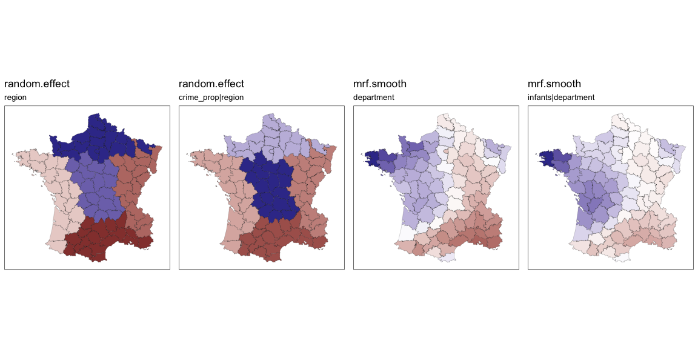

Or fit a more complex mixed model:

``` r
prep_data5 <- g |> 
  st_bridges("department")

model5 <- gam(donations ~ 
                s(region, bs="re") + 
                s(region, crime_prop, bs="re") + # county level random coefficient
                s(department, bs='mrf', 
                  xt=list(nb=prep_data5$nb),k=20) + # ICAR constituency level varying coefficents
                s(department, by=infants, bs='mrf', 
                  xt=list(nb=prep_data5$nb),k=20), # ICAR constituency level varying coefficents
              data=prep_data5, method="REML") |> 
  st_augment(prep_data5) |> # pipe into function to get estimates
  st_quickmap_preds() # pipe into this for visualisation

ggarrange(plotlist = model5, legend = "none", nrow = 1)
```


