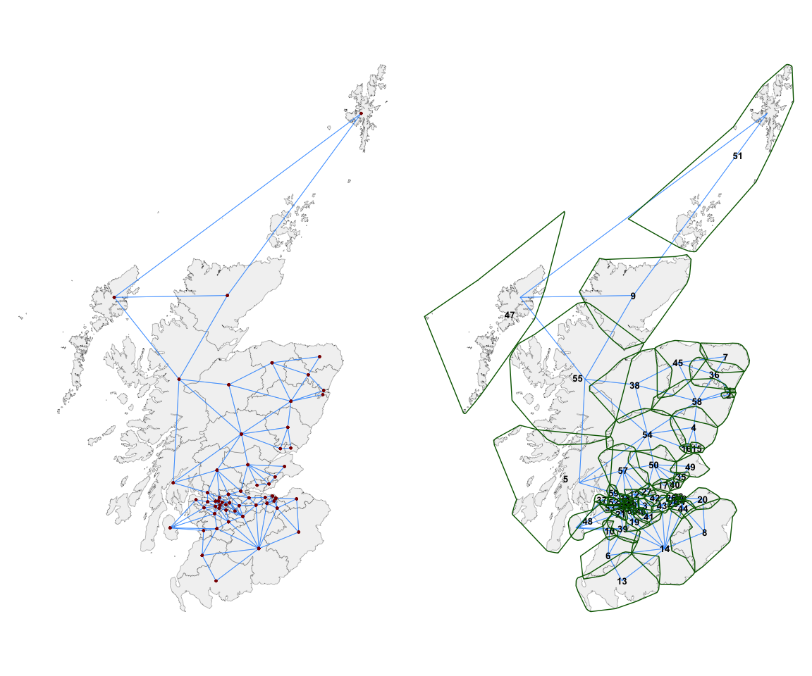

# sfislands 

<!-- badges: start -->
<!-- badges: end -->

The goal of `sfislands` is to make it easier to deal with geographic
datasets which contain islands. It does so using a tidy framework in the
spirit of Josiah Parry’s [sfdep](https://sfdep.josiahparry.com/)
package.

- These do not have to be *islands* by a traditional *land and water*
  geographic definition, but any situation where discontiguous
  geographical units are present.

Such a situation can lead to two issues.

- Firstly, if unaddressed, the presence of such islands or exclaves can
  make certain types of contiguity-based modelling impossible.

- Secondly, just because two areas are separated by, say, a body of
  water, this does not necessarily mean that they are to be considered
  independent of each other.

This package offers solutions to allow for the inclusion or exclusion of
these units within an uncomplicated workflow.

A pre-print of a paper discussing the package is available
[here](https://arxiv.org/abs/2404.09863).

## Installation

Install the released version from CRAN:

``` r
install.packages("sfislands")
```

You can install the development version of `sfislands` from
[GitHub](https://github.com/horankev/sfislands) with:

``` r
# install.packages("devtools")
devtools::install_github("horankev/sfislands")
```

## Summary of features

1.  The initial setting-up of neighbourhood structures can be
    frustrating for people who are eager to get started with fitting
    spatial models. This is especially so when the presence of
    discontiguities within a geographical dataset means that, even
    having set up a neighbours list, the model will still not run
    without further awkward data manipulations.

2.  As an aid to setting up neighbourhood structures, particularly when
    islands are involved, the package has a function to quickly map any
    neighbourhood structure for visual inspection. This can also be used
    to examine the output of `sfdep` neighbour functions. Such maps can
    be used to check if the structure makes sense, given the
    researcher’s knowledge about the geography of the study area.

3.  If some units have been assigned as neighbours inappropriately, or
    if we wish to add additional connections, there are functions to
    allow this to be done in a straightforward and openly reportable
    way.

4.  Once an appropriate neighbourhood structure is in place, different
    types of statistical tests and models can be performed. `sfdep`
    contains functionality to perform such tests, and the output from
    `sfislands` can be used in its functions.

5.  The contiguity outputs from `sfislands` can be directly used to fit
    different types of (multilevel) (I)CAR models using, for example,
    the `mgcv`, `brms`, `stan` or `INLA` packages.

6.  For `mgcv` in particular, the predictions of such models can be
    quite tedious to extract and visualise. `sfislands` can streamline
    this workflow from the human side. Furthermore, there is a function
    to draw maps of these predictions for quick inspection.

## Functions overview

The following is a brief explanations of the functions contained in the
`sfislands` package and a workflow within which they could be used.

The first group can be seen as pre-functions, designed to create a
neighbourhood structure suitable for certain types of models.

Once a model has been fit (using `mgcv` in this case), the
post-functions can be used to extract the predictions.

### Step 1: Set up data (“*pre-functions*”)

| function:               | purpose:                                                                                                                                   |
|-------------------------|--------------------------------------------------------------------------------------------------------------------------------------------|
| **st_bridges()**        | *Create a neighbours list, matrix, or `sf` dataframe containing a neighbours list or matrix as column “nb”, while accounting for islands.* |
| **st_quickmap_nb()**    | *Check contiguities visually on map.*                                                                                                      |
| **st_check_islands()**  | *Check assignment of island contiguities in a dataframe.*                                                                                  |
| **st_manual_join_nb()** | *Make manual changes to any connections.*                                                                                                  |
| **st_manual_cut_nb()**  | *Make manual changes to any connections.*                                                                                                  |

### Step 2: Create model

Use the output of `st_bridges()` as both the data and neighbourhood
inputs for a model using, for example, `mgcv`, `brms` or `inla`.

### Step 3: Examine output (“*post functions*”)

| function:               | purpose:                                                 |
|-------------------------|----------------------------------------------------------|
| **st_augment()**        | *Augment the original dataframe with model predictions.* |
| **st_quickmap_preds()** | *Generate quick maps of these predictions.*              |

## Workflow

The dataset `uk_elections`, which is provided with the package, is used
for the following demonstrations. It is an `sf` dataset with geometries
for each of the 632 Westminster parliamentary constituencies of England,
Scotland and Wales in the 2019 general election. For each constituency,
it contains socio-economic data from the 2011 census. It also shows the
*Butler swing* between the 2017 and 2019 elections, which is a measure
of the change in voter allegiance in favour of the Conservative Party
from the Labour Party.

### Pre-functions: Creating desired adjacency structure

To demonstrate the `st_bridges()` function for preparing an adjacency
matrix, we focus on Scotland. It is the nation with the highest number
of islands. The function, with default arguments, returns a dataframe
with an additional column named `nb`. This column is a named
neighbourhood list of class `nb`. The default neighbourhood structure
which it computes is:

1.  for constituencies which are **not islands**, first-order queen
    contiguity. A constituency is considered to be a neighbour of all of
    those with which it shares at least a vortex.

2.  for **islands**, contiguities are assigned to the two nearest
    constituencies to each island. This number can be altered using the
    `link_islands_k` argument.

``` r
nbsf <- st_bridges(df = uk_election |> filter(country == "Scotland"),
                   geom_col_name = "constituency_name",
                   link_islands_k = 2)
```

This new dataframe has the following form (with a column named `nb`
containing a neighbours list):

``` r
head(nbsf)
#> Simple feature collection with 6 features and 10 fields
#> Geometry type: GEOMETRY
#> Dimension:     XY
#> Bounding box:  xmin: 92527.68 ymin: 571251.1 xmax: 397261.7 ymax: 812377.5
#> Projected CRS: OSGB36 / British National Grid
#>   degree_educated health_not_good     white  con_swing population   region
#> 1       0.2659346      -0.8699365 0.1441816  7.1285493      99654 Scotland
#> 2       1.6283752      -1.7731408 0.3038995  2.9732599      93197 Scotland
#> 3      -1.3538678       0.8155333 0.6963927 -0.2362672      85845 Scotland
#> 4      -0.6852759      -0.6765349 0.7250742  1.7350840      86004 Scotland
#> 5       0.2535023      -0.3624242 0.7174423  3.9062703      88166 Scotland
#> 6      -0.6898382       0.6590625 0.7272781  4.4404142      93308 Scotland
#>     county        constituency_name  country                     nb
#> 1 Scotland           Aberdeen North Scotland              2, 36, 58
#> 2 Scotland           Aberdeen South Scotland                  1, 58
#> 3 Scotland       Airdrie and Shotts Scotland 11, 12, 41, 42, 43, 46
#> 4 Scotland                    Angus Scotland         15, 16, 54, 58
#> 5 Scotland          Argyll and Bute Scotland         54, 55, 57, 59
#> 6 Scotland Ayr, Carrick and Cumnock Scotland         10, 13, 14, 39
#>                         geometry
#> 1 MULTIPOLYGON (((395379.7 80...
#> 2 POLYGON ((396214 805849.7, ...
#> 3 POLYGON ((290854.4 662154.9...
#> 4 POLYGON ((374164.5 762668.6...
#> 5 MULTIPOLYGON (((139257.4 64...
#> 6 MULTIPOLYGON (((246939 6250...
```

We can inspect (and openly report) what additional contiguities have
been added to the standard queen contiguity structure using the function
`st_check_islands()`.

``` r
st_check_islands(nbsf)
#>           island_names island_num nb_num                              nb_names
#> 1 Na h-Eileanan An Iar         47      9 Caithness, Sutherland and Easter Ross
#> 2 Na h-Eileanan An Iar         47     51                   Orkney and Shetland
#> 3 Na h-Eileanan An Iar         47     55               Ross, Skye and Lochaber
#> 4  Orkney and Shetland         51      9 Caithness, Sutherland and Easter Ross
#> 5  Orkney and Shetland         51     47                  Na h-Eileanan An Iar
```

The overall contiguity structure can be visualised using the function
`st_quickmap_nb()`, whose output is shown below on the left.

``` r
ggarrange(
  st_quickmap_nb(nbsf),
  
  st_quickmap_nb(nbsf,
                 concavehull = TRUE,
                 nodes = "numeric",
                 numericsize = 3.5),
  
  ncol = 2
)
```



However, it is often the case that each *island* unit (in this case,
constituency) is in fact a multipolygon of islands. To make this
clearer, the argument `concavehull = TRUE` can be chosen. These green
boundaries (shown above on the right) around each constituency are for
reference purpose only and do not influence the assignment of
contiguities. They show which group of *islands* are considered as one
*constituency of islands*. Furthermore, the argument `nodes = "numeric"`
represents the centroids of each unit with its index number instead of a
geometric point. This can be useful for editing the adjacencies,
particularly if the researcher is not familiar with the names of the
individual spatial units.

#### Editing contiguities

A researcher can now use domain knowledge or a particular hypothesis to
edit these contiguities. For instance, we may not be happy with the
connection between 47 (Na h-Eileanan An Iar) and 51 (Orkney and
Shetland) and wish to remove it. We might instead feel that it is
important for 47 and 5 to be considered neighbours. This can be easily
achieved, as shown below, using the `st_manual_cut_nb()` and
`st_manual_join_nb()` functions. The spatial units whose relationships
we wish to change can be referenced by name or by index number.

``` r
nbsf <- st_bridges(df = uk_election |> filter(country == "Scotland"),
                   geom_col_name = "constituency_name",
                   link_islands_k = 2) |> 
  st_manual_cut_nb("Na h-Eileanan An Iar", "Orkney and Shetland") |> 
  st_manual_join_nb(47, 5)
```

The results of these changes as visualised in map form are shown below:

``` r
ggarrange(
  st_quickmap_nb(nbsf,
                 concavehull = TRUE,
                 nodes = "numeric",
                 numericsize = 3.5),
  
  st_quickmap_nb(nbsf),
  
  ncol = 2
)
```


The above process can be iterated until we are happy that the structure
conforms with our hypothesis of connectivity within the study area.

### Modelling & post-functions

Having set up a neighbourhood structure and embedded it as a named list
or matrix within the original `sf` dataset as a column named `nb`, the
workflow to generate and visualise predictions from a model (in this
case using `mgcv`) is very straightforward and consists of only 3-4
lines of code.

For example, we can use the `mgcv` package to generate quite a
complicated model with various random intercepts and slopes at region
and county level, and additionally, different Markov Random Field ICAR
smooths at the constituency level. This is done very quickly by

- using `st_bridges()` to prepare the data,
- putting that inside the `mgcv::gam()` formulation, and then
- piping into the `st_augment()` function.

This gives the following output, with all of the spatially varying
predictions and their standard errors being added as extra columns
before the final geometry column:

``` r
prep_data <- st_bridges(uk_election, "constituency_name") # decide upon the contiguities and add them to the df

model1 <- gam(con_swing ~ 
               s(region, bs="re") + # region level random intercept
               s(county, bs="re") + # county level random intercept
               s(county, degree_educated, bs="re") + # county level random coefficient
               s(constituency_name, bs='mrf', 
                 xt=list(nb=prep_data$nb),k=10) + # ICAR constituency ICAR varying coefficients
               s(constituency_name, by=white, bs='mrf', 
                 xt=list(nb=prep_data$nb),k=10), # ICAR constituency ICAR varying coefficients
             data=prep_data, method="REML") |>  # pipe into function to get estimates
  st_augment(prep_data)

head(model1)
#> Simple feature collection with 6 features and 20 fields
#> Geometry type: GEOMETRY
#> Dimension:     XY
#> Bounding box:  xmin: 264110.4 ymin: 148666.1 xmax: 488768.5 ymax: 812377.5
#> Projected CRS: OSGB36 / British National Grid
#>   degree_educated health_not_good      white  con_swing population     region
#> 1     -1.21794372       2.4694480  0.6393329  8.5917223      66133      Wales
#> 2      0.04609836       0.5666903  0.6561204  2.2040312      56415      Wales
#> 3      0.26593462      -0.8699365  0.1441816  7.1285493      99654   Scotland
#> 4      1.62837520      -1.7731408  0.3038995  2.9732599      93197   Scotland
#> 5     -1.35386780       0.8155333  0.6963927 -0.2362672      85845   Scotland
#> 6     -0.21109416      -1.3619136 -0.1675498  5.6993250     103922 South East
#>           county  constituency_name  country                           nb
#> 1 West Glamorgan           Aberavon    Wales  80, 157, 371, 419, 451, 547
#> 2          Clwyd          Aberconwy    Wales                 12, 141, 181
#> 3       Scotland     Aberdeen North Scotland                  4, 239, 595
#> 4       Scotland     Aberdeen South Scotland                       3, 595
#> 5       Scotland Airdrie and Shotts Scotland 142, 156, 309, 327, 332, 369
#> 6      Hampshire          Aldershot  England            70, 395, 517, 544
#>   random.effect.region random.effect.county
#> 1           0.07736634           -0.0889861
#> 2           0.07736634           -0.1062061
#> 3          -1.69257542           -0.2986088
#> 4          -1.69257542           -0.2986088
#> 5          -1.69257542           -0.2986088
#> 6          -0.60617303            0.2472990
#>   random.effect.degree_educated|county mrf.smooth.constituency_name
#> 1                           -3.0504238                   0.08001029
#> 2                           -1.6077523                   0.10070833
#> 3                           -0.1165337                  -0.30112582
#> 4                           -0.1165337                  -0.30111510
#> 5                           -0.1165337                  -0.34218741
#> 6                           -2.0453936                   0.01698329
#>   mrf.smooth.white|constituency_name se.random.effect.region
#> 1                          0.9971918               0.5881627
#> 2                          1.2785329               0.5881627
#> 3                          1.2800763               0.6985112
#> 4                          1.2799615               0.6985112
#> 5                          1.7736548               0.6985112
#> 6                         -0.1353957               0.5113682
#>   se.random.effect.county se.random.effect.degree_educated|county
#> 1               0.4400444                               1.0549478
#> 2               0.4432314                               1.7152822
#> 3               0.4500975                               0.2933430
#> 4               0.4500975                               0.2933430
#> 5               0.4500975                               0.2933430
#> 6               0.3825063                               0.6696364
#>   se.mrf.smooth.constituency_name se.mrf.smooth.white|constituency_name
#> 1                       0.3101948                             0.7308175
#> 2                       0.2039813                             0.4377840
#> 3                       0.5769227                             1.0462122
#> 4                       0.5769674                             1.0463117
#> 5                       0.4265664                             0.7384490
#> 6                       0.1762707                             0.2423523
#>                         geometry
#> 1 POLYGON ((290786.3 202886.7...
#> 2 POLYGON ((283209.3 381440.5...
#> 3 MULTIPOLYGON (((395379.7 80...
#> 4 POLYGON ((396214 805849.7, ...
#> 5 POLYGON ((290854.4 662154.9...
#> 6 POLYGON ((485408.1 159918.6...
```

The predictions can be quickly visualised using `st_quickmap_preds()`.
As this function generates a list of `ggplots`, they can be conveniently
visualised using the `ggarrange()` function from the `ggpubr` package.

``` r
plots <- st_quickmap_preds(model1)
ggarrange(plotlist = plots, legend = "none", nrow=1)
```


To emphasise the simplicity of the process, the a modified version of
the following sequence of commands will generate a series of plots of
all of the spatially varying elements of a model defined in `mgcv`:

``` r
prep_data <- st_bridges(...)

gam(..., data = prep_data) |> 
  st_augment() |> 
  st_quickmap_preds()
```

It is also possible to conduct the same kind of augmenting and plotting
of models generated using the `lme4` and `nlme` packages.

Further information and vignettes containing more detailed examples are
available [here](https://horankev.github.io/sfislands/).
